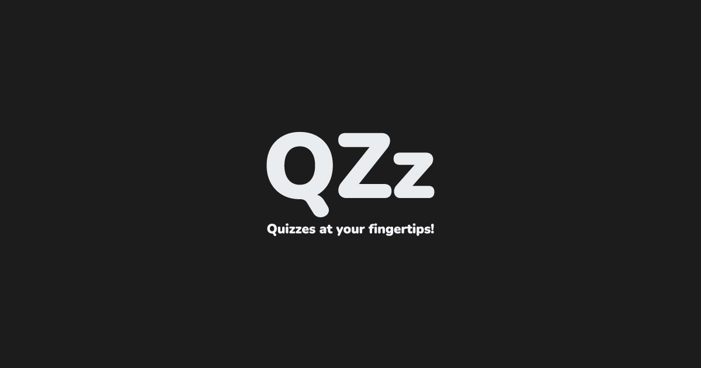
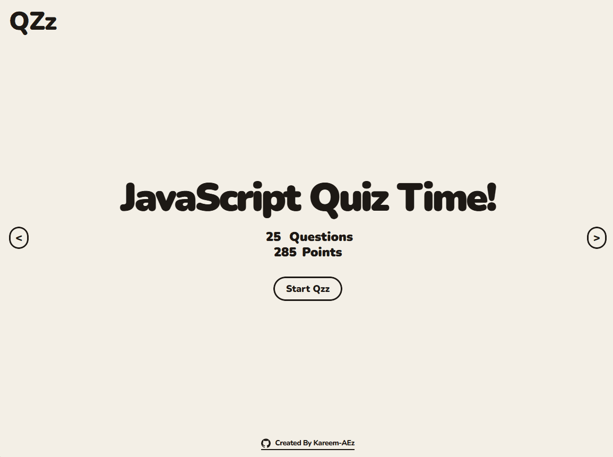

# QZz App 🎯

[](https://reactjs.org/)
[](https://greensock.com/gsap/)
[](LICENSE)
[](https://kareem-aez.github.io/QZz)

> An elegant and dynamic quiz application that makes learning fun and interactive! 🚀

## ✨ Demo

Check out the live demo: [QZz App](https://kareem-aez.github.io/QZz)



## 🌟 Features

- **Dynamic Quiz System** - Add new quizzes effortlessly through a single data file
- **Stunning Animations** - Smooth, eye-catching transitions powered by GSAP
- **Responsive Design** - Perfect experience across all devices
- **Theme Customization** - Each quiz comes with its own unique visual style
- **Interactive Timer** - Keep track of your progress
- **Point System** - Earn points based on difficulty and accuracy

## 🛠️ Tech Stack

- **Frontend Framework**: React 19
- **Animation Library**: GSAP
- **Styling**: CSS Modules
- **State Management**: React Hooks
- **Build Tool**: Create React App

## 🚀 Quick Start

1. Clone the repository:

   ```bash
   git clone https://github.com/Kareem-AEz/QZz.git
   cd QZz
   ```

2. Install dependencies:

   ```bash
   npm install
   ```

3. Start the development server:
   ```bash
   npm start
   ```

## 📝 Adding New Quizzes

Adding a new quiz is as simple as updating the `data.js` file:

```javascript
export const QzzData = {
	NewQuiz: {
		questions: [
			{
				question: "Your question here?",
				options: ["Option 1", "Option 2", "Option 3", "Option 4"],
				correctOption: 2,
				points: 5,
				difficulty: "Easy",
			},
		],
		styles: {
			color: "#000000",
			backgroundColor: "#FFFFFF",
		},
	},
};
```

## 🎨 Customization

Each quiz can be customized with:

- Custom color schemes
- Different difficulty levels
- Varied point systems
- Unique questions and answers

## 🤝 Contributing

Contributions are what make the open source community amazing! Any contributions you make are **greatly appreciated**.

1. Fork the Project
2. Create your Feature Branch (`git checkout -b feature/AmazingFeature`)
3. Commit your Changes (`git commit -m 'Add some AmazingFeature'`)
4. Push to the Branch (`git push origin feature/AmazingFeature`)
5. Open a Pull Request

## 👏 Acknowledgments

- Based on and inspired by the "React Quiz App" project from Jonas Schmedtmann's Ultimate React Course
- Enhanced with additional features like:
  - Multiple quiz categories
  - Dynamic theming
  - GSAP animations
  - Custom hover effects
  - Expandable quiz database
- Built with React and GSAP
- Special thanks to all contributors

---

<p align="center">Made with ❤️ by Kareem-AEz</p>
